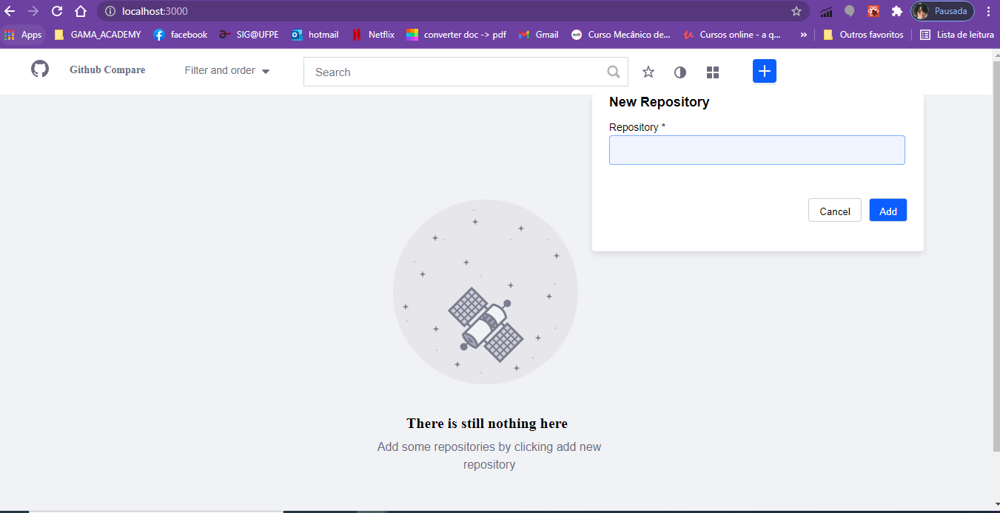

# Github Compare Repositories

## Available Scripts

You're going to need to install all the dependencies with:
- npm install

In the project directory, you can run:

### `npm start`

## Data Management - Redux Toolkit
The data is managed with react redux toolkit and it's persisted at the localStorage with redux persistor. 

### The home page

The firts page shows the menu with the empty State wich means there is no one repository added. It is the inicial state.

To add a new repositorie you have to click on the plus button at right. And put the 'user/repository' that you want to add on the input. To close the modal, you can click again on the plus button

## The Dashboard page
Once you add a repository at the button "Add", you're going to be redirected to the dashboard page where we have all the repositories added, listed in a card with some information about it.

## Filtering a repository by order
To filter a repository by order of stars, you can click on the stars option at the drop-down and it will be automatically odered.

You can see the cards changed to the decreasing number of stars

## Deleting a repository
Once you want to delete a repository, you can click on trash button and it will be automatically deleted:

When you delete all the repositories, you'll be redirected to the emptyState page again.

## Filtering by search input

If you want to search a unique repository, you cant search it by the search input. It's just to put "user/repository" at the input and click on button search. Then it will filter the only to you. To back to all repositories, you just need to drain out the search input.

If the repository you searched isn't contained at the repositories list, you will be redirect to the empty State page. You can click on the button "Clear Filter" to be redirected back to the dashboard page.

## Filter by stared repositories 
You can also favorite repositories and click at the menu start to filter only the favorite repositories:

